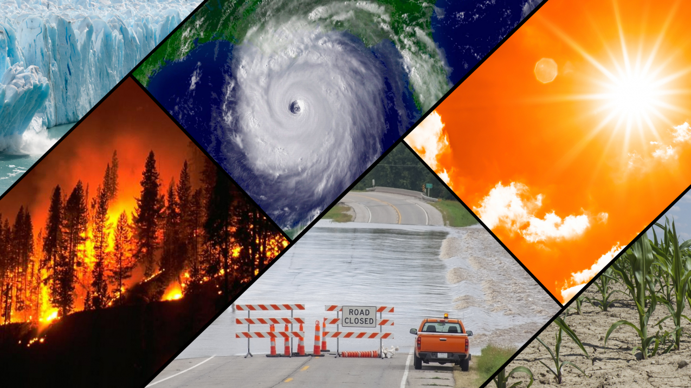
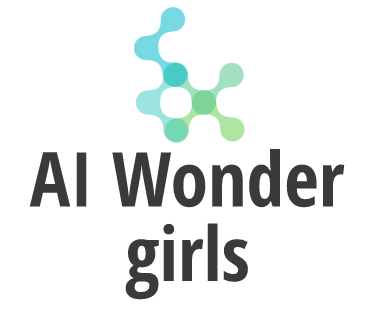

# AWS Disaster Response

Image credit: NOAA

Find out more about this project at its [Devpost page](https://devpost.com/submit-to/14056-aws-disaster-response-hackathon/manage/submissions).

## Meet the team

This repository contais the work of the **AI Wonder Girls** team for the [AWS Disaster Response Hackathon](https://awsdisasterresponse.devpost.com/)! 

## Inspiration 
The **AI wonder Girls** team members are experienced data scientists passionate about contributing their skills to social impact related projects.

## What our tool does
Our AI assistant is an application that combines multiple advanced AI techniques to help user during an earthquake emergency.

Using machine learning models, our assistant is trained to estimates the number of affected people in an earthquake event, based on the data of multiple official databases (USGS.gov, EMDAT and World Bank indicators).

The application utilizes WHO and disaster response guidelines combined with the number of affected estimations to build a package of food and non-food items necessary to supply the affected populations during the emergency.

Our application also aims to support civilians and local authorities during earthquakes. By providing analytics on the topic, a newspapers news search about earthquakes and an integrated chatbot, users are able to receive reliable information on first aid and standard protocol for emergencies.

We believe that our application can significantly improve the efficiency of humanitarian logistics operations and ultimately save lives.

The **implementation** 

The AI for Disaster Assistant is built using a Streamlit front end web end application integrated to the AWS Sagemaker Lab via a continuous integration deployment, where different AI applications are trained.

Details of implementation of each feature in the application are:

  - **Analytics Module:** contains historical information summarized in visualizations to help the users to understand the global context of earthquake catastrophes. This feature is aimed to bring value to local authorities and support a data-driven decision making on mitigating actions.

- **Relief Package Module:** implementation of state of the art machine learning models on a multiple context dataset, which connects earthquake, disaster management and socioeconomic contexts.

- **Chatbot Module:** implementation of a chatbot which assists users by answering questions about earthquakes and first aid practices.

 - **Earthquake News Module:** scrapes articles about earthquakes from newspapers and Twitter and displays their information and URLs.

## Accomplishments that we're proud of
- Training an AI model for aiding relief efforts to Earthquake disaters by predicting the affected poulation.
- Building an Application User interface with Streamlit and Python.
- Allowing people to query disaster related details through NLP reports. 
- Make it easier to user to find local news about earthquakes. 

And of course, we are proud of participating in another inspiring Hackathon!
 

## The pillars of our project

## The pillars of our project

## What's next 
- Extending the app to other applications.
- Adding more reliable data sources to the existing modules.
